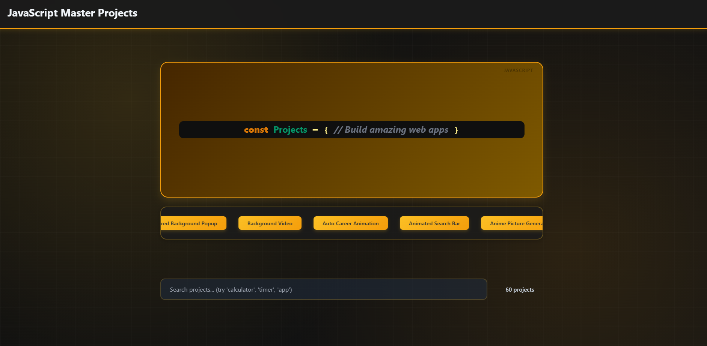

## 📹 Project Showcase



Add your demo \`.mp4\` files here (1280×720 or 1920×1080, 15-30 seconds). Place in root or \`demos/\` folder.


## 🛠️ Tech Stack

* 🧱 **HTML** – Semantic structure
* 🎨 **CSS** – Modern styling with gradients & animations
* ⚡ **JavaScript (ES6+)** – Logic & interactivity
* 🎯 **Responsive Design** – Mobile-first approach


## 📁 Project Structure

```
Web-Dev-Projects/
├── index.html              # Homepage with project grid
├── README.md               # Documentation
├── css/
│   ├── style.css          # Component styles (yellow/gold theme, 589 lines)
│   └── gradient.css       # Breathing animation & dark mode
├── js/
│   ├── main.js            # App logic & navigation
│   ├── projects.config.js # 60 project metadata
│   ├── projects/          # 60 individual project files
│   └── utils/
│       └── helpers.js     # Reusable utilities
└── demos/                 # [Optional] .mp4 showcase videos
```


## 📋 Folder Descriptions

**index.html** – Modern homepage with yellow code tab, marquee, search bar, responsive grid of 60 projects.

**css/style.css** – Primary styles: header, buttons, cards, animations, mobile breakpoints (768px & 480px).

**css/gradient.css** – Breathing grid background (12s-14s cycle), dark mode support, glassmorphism effects.

**js/main.js** – Homepage rendering, project search/filter, navigation management.

**js/projects.config.js** – Array of 60 projects with id, title, file properties.

**js/projects/** – 60 self-contained modules: Calculators, Clocks, Games, Todo, Weather, Gallery, Sliders, Animations, and more.

**js/utils/helpers.js** – DOM helpers, event utilities, formatting functions.


## 🚀 How to Use

```bash
git clone https://github.com/CodeNaveen-in/Web-dev-Projects.git
cd Web-dev-Projects
```
1. Open `index.html` in your browser
2. Use search bar to filter projects
3. Click any project card to launch
4. Use back button to return home
5. Explore project code in `js/projects/`


## ✨ Key Features

🎨 **Modern Design** – Yellow/gold theme, white containers, breathing grid background, smooth animations

🔍 **Smart Search** – Real-time filtering across 60 projects with status display

📱 **Responsive** – Mobile-first design, optimized for tablets (768px) and phones (480px)

🌙 **Dark Mode** – Automatic detection with distinct color scheme


## 🤝 Contributing

1. Fork the repo
2. Create a feature branch
3. Add improvements (projects, fixes, videos)
4. Submit a Pull Request

Feel free to use these projects for learning and practice!

<h1>Made with 💖 by Naveen Garg</h1>